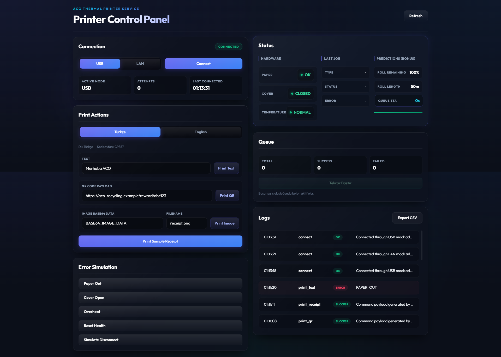
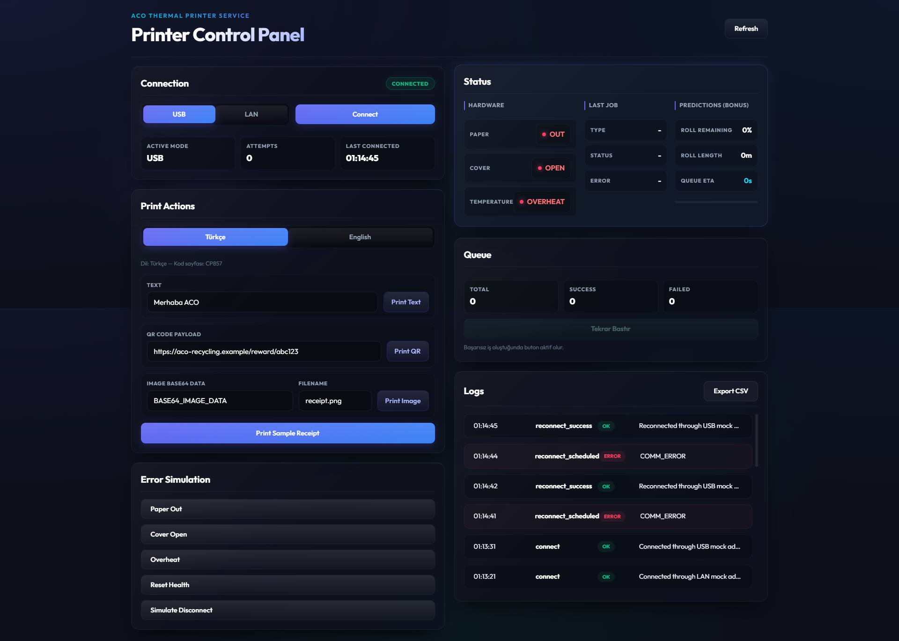
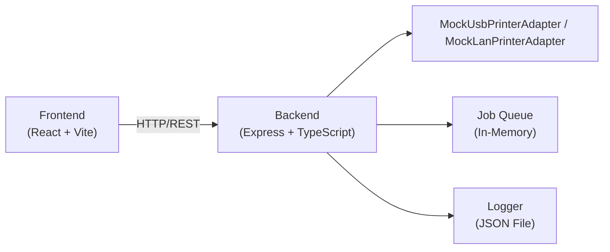

# Termal Yazıcı Servisi Teknik Dokümantasyonu

Canlı demo: https://aco-recycling-task.online/

Hazır Postman koleksiyonu: `postman/ThermalPrinter.postman_collection.json`

Merhaba. Bu dökümanda geliştirdiğim termal yazıcı entegrasyon servisinin tüm mimarisini, kurulum adımlarını, API uçlarını ve simülasyon detaylarını anlatmaya çalıştım. Projeyi tasarlarken hem core gereksinimleri eksiksiz karşılamaya hem de belirtilen bonus özellikleri ekleyerek modüler ve type-safe bir yapı kurmaya özen gösterdim.

Fiziksel bir yazıcıya erişimim olmadığı için sistemi tamamen mock/simülasyon katmanları üzerinden kurguladım. İleride gerçek bir donanım geldiğinde sadece ilgili adaptör sınıfını yazarak sisteme kolayca entegre edebilmemiz için kod tabanını arayüz (interface) tabanlı tasarladım. Ayrıca projede hicbir yerde type safety'yi bozmamak adına "any" kullanmadım.

## Ekran Görüntüleri

| Bağlı | Hata |
|:-----:|:----:|
|  |  |

## Proje Hakkında ve Amaç

Bu servis, geri dönüşüm otomatlarında atık karşılığı verilen ödül fişlerini (normal metin, resim, QR kod ve detaylı fiş formatında) termal yazıcılar vasıtasıyla yazdırmak amacıyla geliştirilmiştir. Sistem, localhost üzerinde Express.js backend ve modern bir React (Vite) frontend uygulaması olarak iki parça halinde çalışır.

## Kullanılan Teknolojiler

Servisin geliştirilmesinde aşağıdaki teknolojileri tercih ettim:

- Core: Node.js (Express.js) ve TypeScript
- Frontend: React (Vite), TypeScript, saf CSS (Outfit yazı tipi ve glassmorphic karanlık tema tasarımı ile)
- Loglama: JSON dosya tabanlı loglama servisi ve CSV log export aracı
- Docker yapılandırması: Multi-stage Dockerfile ve docker-compose yapılandırması

## Sistem Mimarisi ve Klasör Düzeni

Projeyi katmanlı mimariye uygun şekilde tasarlamaya çalıştım. İş mantığı, HTTP katmanı ve donanım erişim katmanları birbirinden bağımsızdır:

### Mimari Şema



### Katman ve Teknoloji Tablosu

| Katman | Teknoloji / Araçlar | Port / Detay |
|--------|---------------------|--------------|
| Frontend | React 19, Vite 8, TypeScript | 5173 (Development) |
| Backend | Express 5, TypeScript 6, Node.js 22 | 3000 |
| Docker | Multi-stage build, Alpine Linux | 3000 |

### Katman Açıklamaları

- Controller Katmanı: Gelen HTTP isteklerini karşılar, validator yardımcıları yardımıyla body doğrulamasını yapar ve servis katmanına iletir.
- Servis Katmanı (Printer Service): Yazdırma işlerini yönetir, kuyruğa ekler, hata durumlarında loglama yapar ve başarısız olan resim yazdırma isteklerini diskte yedekler.
- Adaptör Katmanı (Printer Adapter): Donanım ile doğrudan iletişim kuran katmandır. `backend/src/adapters/printer.adapter.ts` içindeki kontrat sayesinde servis katmanı yazıcının USB veya LAN implementasyonu olduğunu bilmeden aynı arayüzle çalışır. Şu an fiziksel cihaz zorunlu olmadığı için ayrı `MockUsbPrinterAdapter` ve `MockLanPrinterAdapter` implementasyonları kullanılmaktadır.
- Kuyruk Katmanı (Job Queue): In-memory çalışan, iş durumlarını takip eden hafif bir kuyruk yapısıdır.
- Loglama Katmanı (Logger Service): Tüm başarılı ve başarısız işlemleri belirtilen log şemasına uygun şekilde JSON formatında diske kaydeder ve CSV formatında export edilmesini sağlar.

Klasör yapısı şu şekildedir:

```text
backend/src/
  adapters/                 Yazıcı adapter kontratı, mock USB ve mock LAN implementasyonları
  controllers/              HTTP isteklerini karşılayan kontrolcüler
  middleware/               Bearer token yetkilendirme katmanı
  routes/                   API yönlendirme tanımları
  services/                 Yazıcı iş mantığı ve ESC/POS komut oluşturucu
  queue/                    In-memory kuyruk yöneticisi
  logs/                     JSON log kaydedici ve CSV export sınıfı
  types/                    TypeScript tip tanımları (Dış API ve İç modeller)
  utils/                    Tip güvenli validator yardımcıları
  app.ts                    Express sunucu kurulumu
  server.ts                 Giriş noktası ve port dinleme
```

## Datasheet Varsayımları

Bu servis, görev paketinde sağlanan Cashino KP-300, KP-301H ve KP-302 termal yazıcı datasheet'leri referans alınarak tasarlanmıştır.

Datasheet'lerde hedef yazıcı ailesinin USB ve LAN/Ethernet haberleşmesini, ESC/POS uyumlu komut yapısını, QR/2D barkod yazdırmayı, termal rulo kağıt baskısını, kağıt bitti algılamayı, kapak açık algılamayı, kesici/kağıt sıkışması senaryolarını ve aşırı sıcaklık korumasını desteklediği görülmektedir.

Bu aşamada fiziksel donanım zorunlu olmadığı için bu donanım kabiliyetleri mock yazıcı adapter katmanı üzerinden temsil edilmiştir. Mock adapter katmanı, gerçek bir donanım adapter'ının taşıyacağı sorumlulukları korur: bağlantı yönetimi, aktif bağlantı modu takibi, yazıcı sağlık durumu, haberleşme hataları, baskı komutu yürütme ve reconnect/backoff davranışı.

Aşağıdaki uygulama kararları datasheet'lerdeki kabiliyetlerden türetilmiştir:

| Datasheet Kabiliyeti | Uygulamadaki Karşılığı |
|---|---|
| USB arayüzü | `POST /connect` endpoint'i `mode: "usb"` kabul eder ve UI aktif USB modunu gösterir |
| LAN/Ethernet arayüzü | `POST /connect` endpoint'i `mode: "lan"` kabul eder ve UI aktif LAN modunu gösterir |
| ESC/POS komut desteği | `EscposBuilder`, metin, görsel, QR ve fiş işlerini mock ESC/POS komut payload'larına dönüştürür |
| QR Code / 2D barkod desteği | `/print/qr` endpoint'i ve fiş içindeki QR payload desteği |
| Kağıt bitti algılama | `PAPER_OUT` simülasyonu, `/status.health.paper`, kullanıcı dostu UI hatası ve log kayıtları |
| Kapak açık algılama | `COVER_OPEN` simülasyonu, `/status.health.cover`, kullanıcı dostu UI hatası ve log kayıtları |
| Aşırı sıcaklık koruması | `OVERHEAT` simülasyonu, `/status.health.temperature`, kullanıcı dostu UI hatası ve log kayıtları |
| Kağıt sıkışması / kesici sıkışması senaryoları | `PAPER_JAM` simülasyonu, failed job takibi ve reprint akışı |
| Durum göstergeleri / sensör durumları | `/status` endpoint'i bağlantı, kağıt, kapak, sıcaklık, son iş ve kuyruk özetini döner |
| Termal fiş baskısı | Özel `/print/receipt` endpoint'i, sağlanan örnek ACO ödül fişi görselini model alır |
| Fiziksel donanımın bu aşamada bulunmaması | Arayüz tabanlı adapter tasarımı, mock adapter'ın ileride gerçek USB/LAN adapter ile değiştirilebilmesini sağlar |

## Kurulum ve Çalıştırma Adımları

Projeyi çalıştırmak için iki farklı yöntemi de destekleyecek şekilde yapılandırdım.

### 1. Yerel Makinede Tek Komutla Başlatma

Backend ve frontend'i birlikte geliştirme modunda başlatmak için kök dizinde şu komutları çalıştırabilirsiniz:

```bash
npm install
npm run dev
```

Bu komut backend'i `http://localhost:3000`, frontend'i ise Vite geliştirme portunda başlatır.

Backend ve frontend'i ayrı terminallerde çalıştırmak isterseniz aşağıdaki komutları da kullanabilirsiniz:

```bash
cd backend
npm install
npm run dev

cd frontend
npm install
npm run dev
```

Varsayılan olarak backend 3000 portunda (http://localhost:3000), frontend ise Vite'ın atadığı portta çalışır. Frontend API isteklerini backend'e gönderecek şekilde yapılandırılmıştır.

### 2. Docker Compose ile Backend Başlatma

Backend servisini Docker Compose ile tek komutta ayağa kaldırmak isterseniz kök dizindeyken şu komutu çalıştırabilirsiniz:

```bash
docker compose up --build
```

Bu compose dosyası backend'i container içinde `3000` portunda çalıştırır ve host makinede `http://localhost:3003` adresine açar. Frontend'i lokal geliştirme modunda çalıştırmak için ayrı bir terminalde `frontend` klasöründe `npm run dev` komutunu kullanabilirsiniz. Kaydedilen loglar ve başarısız görseller, container silinse dahi kaybolmaması için Docker volume olarak saklanır.

## Çevre Değişkenleri (.env)

Projede hiçbir gizli bilgi veya port ayarı kod içerisine gömülmemiştir. .env.example dosyalarından türeterek kullanabileceğiniz çevre değişkenleri aşağıdadır:

### Backend (.env)
```env
PORT=3000
API_ACCESS_TOKEN=test-token-1234
CORS_ORIGIN=http://localhost:5173
```

### Frontend (.env)
```env
VITE_API_BASE_URL=http://localhost:3000
VITE_API_ACCESS_TOKEN=test-token-1234
```

Not: Lokal geliştirme ve testlerin kolay yapılabilmesi için `test-token-1234` örnek token olarak kullanılmıştır. Production ortamında `API_ACCESS_TOKEN` mutlaka güçlü ve rastgele bir değer olarak tanımlanmalıdır; production modunda backend token eksikse varsayılan token'a düşmez.

## Güvenlik ve Yetkilendirme (Token Tabanlı Erişim)

Lokal/demo API erişimini kontrollü tutmak için basit Bearer token tabanlı bir yetkilendirme katmanı ekledim. `backend/src/middleware/auth.middleware.ts` dosyası içinde yazılan Express middleware, gelen isteklerde `Authorization: Bearer <token>` başlığının bulunup bulunmadığını kontrol eder.
Eğer token geçersiz veya eksikse client'a 401 Unauthorized durum koduyla birlikte şu formatta standart bir hata döner:

```json
{
  "success": false,
  "error": {
    "code": "UNAUTHORIZED",
    "message": "Access token is missing or invalid. Use 'Bearer <token>'."
  }
}
```

Frontend uygulaması, her API isteğinde bu token değerini otomatik olarak header alanına ekler. `VITE_API_ACCESS_TOKEN` tarayıcı bundle'ında görülebilen bir demo/client konfigürasyonudur; gerçek production kullanımında bu yapı tek başına kullanıcı kimlik doğrulaması yerine geçmez. Production deploy'da backend tarafında güçlü `API_ACCESS_TOKEN` kullanılmalı ve `CORS_ORIGIN` yalnızca izin verilen frontend domain'lerine ayarlanmalıdır.

## Kuyruk ve Tekrarlılık Güvenliği (Idempotency)

Aynı yazdırma işinin ağ kesintileri veya çift tıklama gibi nedenlerle tekrar tekrar basılmasını önlemek amacıyla bir idempotency (tek değerlilik) mekanizması kurdum.

- İstek gövdesinde (örneğin `/print/text` isteğinde) opsiyonel olarak `idempotencyKey` alanı gönderilebilir.
- Kuyruk servisi, bu anahtarla daha önce oluşturulmuş ve durumu "failed" olmayan (yani "queued", "printing" veya "success" olan) bir iş olup olmadığını kontrol eder.
- Eğer eşleşen bir iş varsa, sunucu yeni bir yazdırma işi başlatmaz ve in-memory kuyruktaki mevcut iş nesnesini client'a geri döner. Bu sayede kağıt ve zaman israfı önlenmiş olur.

## Tahminleme Motoru (Predictions)

Bonus gereksinimler arasında yer alan tahminleme algoritmalarını mock verilerle entegre ettim:

- Rulo Ömrü Tahmini: Yazıcı ilk açıldığında rulo uzunluğu 50 metre (50000 mm) olarak kabul edilir. Yapılan her başarılı yazdırma işleminde içerik tipine göre (metin için 12mm, QR kod için 45mm, resim için 75mm, fiş için 110mm) kağıt tüketimi hesaplanır. Tüketim miktarı 45 metreye ulaştığında yazıcı durumu otomatik olarak "near_end", 50 metre sınırında ise "out" (kağıt bitti) durumuna geçer.
- Basım ETA Tahmini: Kuyrukta bekleyen işlerin sayısına bağlı olarak dinamik bir yazdırma süresi tahmin edilir. Her yazdırma işinin ortalama 1.2 saniye sürdüğü varsayılmıştır.
- Tüm bu tahminler `/status` api'sinde `predictions` nesnesi altında döner ve frontend arayüzündeki panelde kullanıcıya gösterilir.

## Çoklu Dil, Yerelleştirme ve Ayrıştırılmış Dil Yönetimi

Arayüz ve yazdırma çıktılarının dil yönetimi kullanıcı deneyimini maksimize etmek için birbirinden **tamamen ayrıştırılmış (decoupled)** olarak tasarlanmıştır:

1. **Arayüz Ekran Dili (Global UI Language - TR / EN Toggle):**
   - Sayfanın sağ üst köşesinde (topbar) bulunan **TR / EN** butonu ile tüm sayfanın dilini (başlıklar, buton etiketleri, sensör durum açıklamaları ve test paneli yardımcı açıklamaları) değiştirebilirsiniz.
   
2. **Yazıcı Baskı Dili (Yazıcı Komut Dili - Türkçe / İngilizce):**
   - Yazdırma panelinin içinde yer alan dil seçici, **yalnızca fiziksel yazıcıya gönderilecek ESC/POS komut setini ve kağıt çıktısının dilini (CP857/CP437)** belirlemek üzere izole edilmiştir.
   - `tr` seçildiğinde Türkçe karakter setini destekleyen CP857 kod sayfası, `en` seçildiğinde varsayılan CP437 kod sayfası atanır.

---

## Dinamik Fiş Önizleme Bileşeni

Yazdırma panelinin sağ tarafında, **gerçekçi bir termal kağıt slipi** görünümünde tasarlanmış, tırtıklı kağıt kenar efektli ve monospace yazı tipli dinamik bir **"Live Preview"** alanı bulunmaktadır:
- **Tek Fiş Üzerinden Dinamik Önizleme:** Metin, QR veya görsel alanlarında veri girildiğinde aynı ACO ödül fişi üzerinde ilgili alanlar gerçek zamanlı güncellenir.
- **Baskı Dili Senkronizasyonu:** Fiş önizleme içeriğinin dili (MachineID/Tarih, ürün tablosu, ödül başlığı vb.) yerel Yazıcı Baskı Dili seçimine göre gerçek zamanlı güncellenir.


## API Uçları

### API Uç Haritası

| Metot | Endpoint | Açıklama | Yetkilendirme |
|-------|----------|----------|---------------|
| `POST` | `/connect` | USB veya LAN bağlantısı kurar | Token Gerekli |
| `GET` | `/status` | Bağlantı, donanım sağlığı, kuyruk ve rulo ömrü tahminlerini döner | Token Gerekli |
| `POST` | `/print/text` | Basit metin yazdırır | Token Gerekli |
| `POST` | `/print/image` | Base64 formatında görsel yazdırır (hata durumunda yedekler) | Token Gerekli |
| `POST` | `/print/qr` | QR kod yazdırır | Token Gerekli |
| `POST` | `/print/receipt` | Özel uç: ACO tarzı detaylı ödül fişi basar | Token Gerekli |
| `POST` | `/reprint` | Yalnızca başarısız olmuş bir işi tekrar sıraya alır | Token Gerekli |
| `GET` | `/logs` | Tüm log geçmişini JSON olarak döner | Token Gerekli |
| `GET` | `/logs/export` | Tüm log geçmişini CSV dosyası olarak indirir | Token Gerekli |
| `POST` | `/mock/health` | Simüle edilen yazıcının sensör durumlarını değiştirir | Token Gerekli |
| `POST` | `/mock/disconnect` | Yazıcının bağlantı kopma ve reconnect durumunu simüle eder | Token Gerekli |
| `GET` | `/health` | Servisin aktifliğini kontrol eden basit uç | **Serbest (Yok)** |

Tüm korumalı isteklerde `Authorization: Bearer test-token-1234` başlığı gönderilmelidir.

### 1. Bağlantı Kurma
- HTTP Metodu: `POST`
- Endpoint: `/connect`
- Gövde (Body):
```json
{
  "mode": "usb"
}
```
Not: `mode` değeri sadece `usb` veya `lan` olabilir.

### 2. Durum Sorgulama
- HTTP Metodu: `GET`
- Endpoint: `/status`
- Örnek Yanıt:
```json
{
  "success": true,
  "data": {
    "connection": {
      "mode": "usb",
      "state": "connected",
      "reconnectAttempts": 0,
      "nextReconnectAt": null,
      "lastConnectedAt": "2026-06-04T00:50:00.000Z"
    },
    "health": {
      "paper": "ok",
      "cover": "closed",
      "temperature": "normal"
    },
    "lastJob": null,
    "queue": {
      "queued": 0,
      "printing": 0,
      "success": 0,
      "failed": 0,
      "total": 0
    },
    "predictions": {
      "remainingRollPercentage": 100,
      "remainingRollMeters": 50,
      "printEtaSeconds": 0
    }
  }
}
```

### 3. Metin Yazdırma
- HTTP Metodu: `POST`
- Endpoint: `/print/text`
- Gövde (Body):
```json
{
  "text": "Merhaba Dunya",
  "language": "tr",
  "idempotencyKey": "unique-request-key-1"
}
```

### 4. Resim Yazdırma
- HTTP Metodu: `POST`
- Endpoint: `/print/image`
- Gövde (Body):
```json
{
  "imageBase64": "iVBORw0KGgoAAAANS...",
  "filename": "receipt_image.png"
}
```

### 5. QR Kod Yazdırma
- HTTP Metodu: `POST`
- Endpoint: `/print/qr`
- Gövde (Body):
```json
{
  "data": "https://aco-recycling.com/coupon/123"
}
```

### 6. Fiş Yazdırma
- HTTP Metodu: `POST`
- Endpoint: `/print/receipt`
- Not: Minimum gereksinimlerin üzerine eklenen domain-specific endpoint'tir; ACO tarzı ödül fişini ürün tablosu, toplam ödül, QR payload ve dil/codepage bilgisiyle basar.
- Tasarım notu: Özel `/print/receipt` endpoint'i, görev paketinde sağlanan örnek fiş görselindeki yapı referans alınarak tasarlanmıştır.
- Gövde (Body):
```json
{
  "machineId": "ACO-M-99",
  "rewardName": "Aco Gift Coupon",
  "currency": "TRY",
  "issuedAt": "2025-09-16T16:19:02.000Z",
  "items": [
    { "product": "Plastic Bottle", "quantity": 3, "reward": 3 },
    { "product": "Glass Bottle", "quantity": 2, "reward": 4 }
  ],
  "qrPayload": "ACO|ACO-M-99|2025-09-16T16:19:02.000Z|7.00|TRY",
  "language": "tr"
}
```

### 7. Tekrar Bastırma (Reprint)
- HTTP Metodu: `POST`
- Endpoint: `/reprint`
- Gövde (Body):
```json
{
  "jobId": "failed-job-uuid-here"
}
```
Not: Yalnızca başarısız olmuş (failed) işlerin tekrar basılmasına izin verilir. Başarılı veya kuyrukta bekleyen işler için istek atılırsa hata döner.

### 8. Log Kayıtlarını Çekme
- HTTP Metodu: `GET`
- Endpoint: `/logs`

### 9. Log Kayıtlarını CSV Olarak İndirme
- HTTP Metodu: `GET`
- Endpoint: `/logs/export`

### 10. Sağlık Kontrolü
- HTTP Metodu: `GET`
- Endpoint: `/health`
- Not: Bu endpoint api yetkilendirmesi (Token) gerektirmez. Sunucunun ayakta olup olmadığını kontrol etmek içindir.

## Test ve Hata Simülasyon Senaryoları

Hazır Postman koleksiyonu eklenmiştir: `postman/ThermalPrinter.postman_collection.json`.

Sistem üzerinde hata durumlarının arayüze ve loglara yansımasını test edebilmek için özel mock endpoint'leri tanımladım. Bu endpoint'ler gerçek donanım olmaksızın test yapmayı sağlar.

### Simüle Edilen Hata Kodları Tablosu

Aşağıdaki hata kodları hem simülasyonda hem de API hata dönüşlerinde (ve dosya loglarında) ortak olarak kullanılır:

| Hata Kodu | Açıklama |
|-----------|----------|
| `PAPER_OUT` | Yazıcıda kağıt bitti sensörü tetiklendi |
| `PAPER_JAM` | Yazıcı kafasında kağıt sıkışması oluştu |
| `COVER_OPEN` | Yazıcı kapağının açık olduğu tespit edildi |
| `OVERHEAT` | Yazıcı kafasının aşırı ısındığı algılandı (koruma modu) |
| `COMM_ERROR` | Donanımla kurulan haberleşme hattında kopma oluştu |
| `UNKNOWN_COMMAND` | Yazıcıya gönderilen komut veya parametrelerin geçersiz olması |

> Not: `/mock/health` ile verilen sensör hataları (`PAPER_OUT`, `COVER_OPEN`, `OVERHEAT`) cihaz durumunu `/status` içinde hemen değiştirir. Bu butonlar tek başına print job oluşturmadığı için hata logu, bir sonraki `/print/*` isteği bu durum nedeniyle başarısız olduğunda oluşur. `PAPER_JAM` ve `UNKNOWN_COMMAND` ise UI'daki test butonları üzerinden anında failed test job oluşturur ve doğrudan `/logs` içine hata kaydı yazar.

### Veri Depolama ve Kalıcılık Modeli

| Veri Tipi | Depolama Katmanı | Kalıcılık Durumu | Açıklama |
|-----------|------------------|------------------|----------|
| İş Kuyruğu | In-memory Map | Geçici (restart ile silinir) | İşlerin sırasını ve anlık durumlarını takip eder |
| Bağlantı Durumu | In-memory state | Geçici (restart ile silinir) | Anlık aktif bağlantı modunu ve durumunu yönetir |
| Log Kayıtları | `storage/logs.json` dosyası | Kalıcı (Dosya Sistemi) | Tüm işlemler bu dosyaya JSON nesnesi olarak eklenir (append) |
| Başarısız Resimler | `storage/failed-images/*.json` | Kalıcı (Dosya Sistemi) | Başarısız görsel işlerin base64 dataları kurtarılmak üzere kaydedilir |

### 1. Kağıt Bitti Hatası Simüle Etme
```bash
curl -X POST http://localhost:3000/mock/health \
  -H "Authorization: Bearer test-token-1234" \
  -H "Content-Type: application/json" \
  -d "{\"paper\":\"out\"}"
```
Bu istekten sonra `/status` içinde `paper = out` görünür. Atacağınız sonraki yazdırma isteği `PAPER_OUT` hata koduyla başarısız olur ve log kaydı o başarısız print sırasında oluşur. Tekrar düzeltmek için `"paper":"ok"` gönderebilirsiniz.

### 2. Kapak Açık Hatası Simüle Etme
```bash
curl -X POST http://localhost:3000/mock/health \
  -H "Authorization: Bearer test-token-1234" \
  -H "Content-Type: application/json" \
  -d "{\"cover\":\"open\"}"
```

### 3. Tekil İstekte Hata Simüle Etme
Herhangi bir yazdırma isteği gönderirken gövdeye `simulateError` alanı ekleyerek o isteğin doğrudan başarısız olmasını sağlayabilirsiniz:
```bash
curl -X POST http://localhost:3000/print/text \
  -H "Authorization: Bearer test-token-1234" \
  -H "Content-Type: application/json" \
  -d "{\"text\":\"Test metni\",\"simulateError\":\"PAPER_JAM\"}"
```

### 4. Bağlantı Kesilmesi ve Otomatik Yeniden Bağlanma (Reconnect/Backoff)
```bash
curl -X POST http://localhost:3000/mock/disconnect \
  -H "Authorization: Bearer test-token-1234"
```
Bu komut, yazıcı bağlantısını koparır ve durumu "reconnecting" yapar. Sistem arka planda exponential backoff algoritması ile otomatik yeniden bağlanmayı dener ve loglara kaydeder.

## Loglama Şeması Uyumluluğu

Sistemde yapılan başarılı veya başarısız tüm işlemler `backend/storage/logs.json` dosyasına yazılır. Hata durumlarında yazılan log şeması dokümandaki örnekle tam olarak uyuşmaktadır:

```json
{
  "ts": "2026-06-04T00:50:00.000Z",
  "op": "print_image",
  "conn": "usb",
  "jobId": "9b1deb4d-3b7d-4bad-9bdd-2b0d7b3dcb6d",
  "status": "error",
  "error": {
    "code": "PAPER_OUT",
    "detail": "No paper detected"
  }
}
```

Log dosyasına gereksiz şema dışı alanların yazılmamasına ve okunabilirliğe özen gösterilmiştir.

Dökümanı burada sonlandırıyorum. Projeyi teslim etmek için backend ve frontend dosyalarını tek bir zip arşivi halinde paketleyebilirsiniz. Teşekkür ederim.
